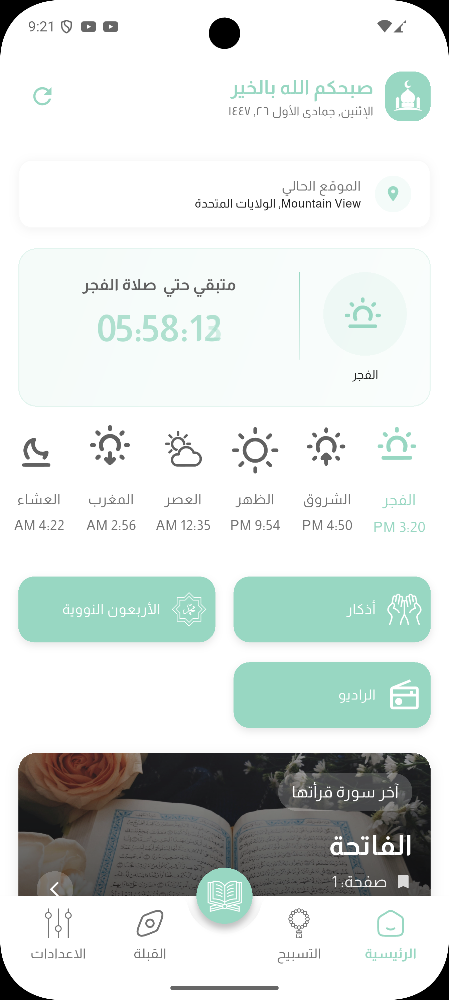
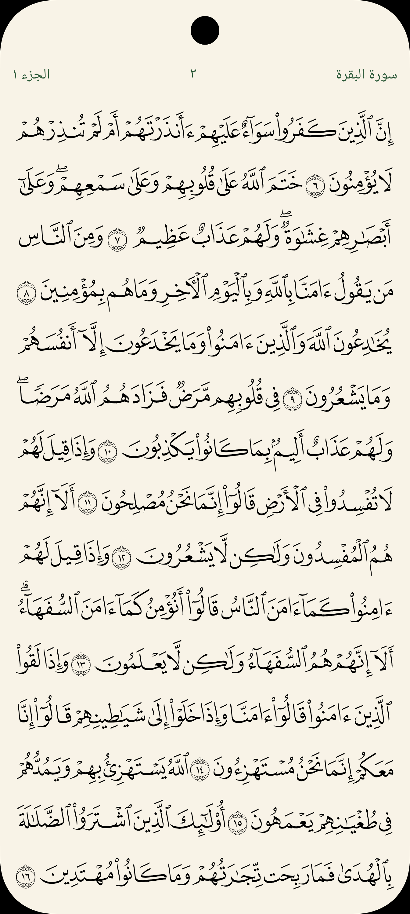
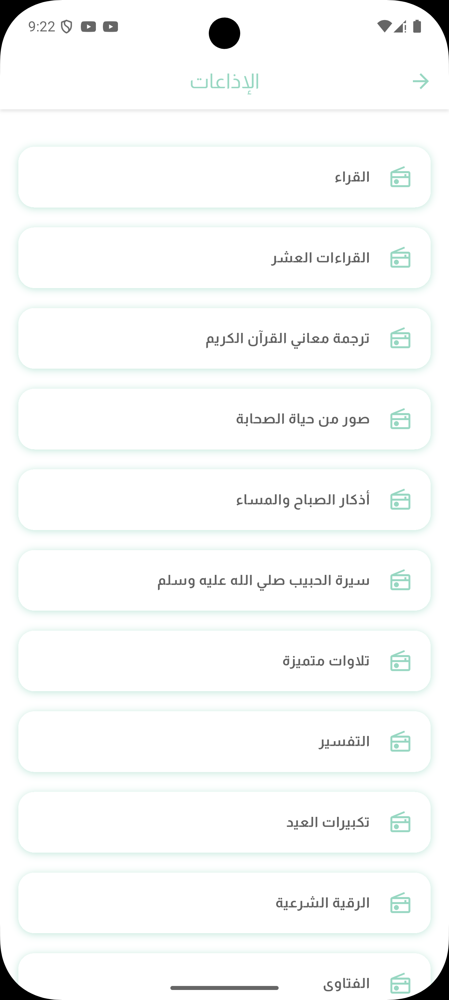

  

<h1 align="center">
  تطبيق قرآني
</h1>

# Qurani – Prayer Times, Quran & Azkar

Qurani is a clean, modern, and ad-free Islamic app built with Flutter.  
It provides accurate prayer times with smart notifications, Qibla direction, full Quran with tafsir, morning and evening adhkar, the Forty Nawawi collection, and Hijri date display — designed for both personal use and mosque display screens.

---

## 🇸🇦🇪🇬 نبذة عن تطبيق قرآني

تطبيق **قرآني (Qurani)** هو تطبيق إسلامي بسيط وحديث وبدون إعلانات، مبني باستخدام Flutter.  
يوفّر لك مواقيت صلاة دقيقة مع تنبيهات، واتجاه القبلة، وقسمًا كاملًا للقرآن الكريم مع التفسير، وأذكار الصباح والمساء، ومتن الأربعين النووية، بالإضافة إلى عرض التاريخ الهجري، مع تصميم مناسب للاستخدام الشخصي على الجوال 

---

## 📱 Download

- **Android APK**: [Download latest version]((https://github.com/Husseinabozina/muslim-app-showcase/releases/download/v1.0.0/qurani.apk))

---

## ✨ Features

- 🕰️ **Prayer Times**
  - Accurate prayer times based on the user’s location  
  - Supports different calculation methods and madhahib for Asr  

- 🔔 **Smart Notifications**
  - Adhan / prayer time notifications for all prayers  
  - Control: enable/disable each prayer notification  

- 🕋 **Qibla Direction**
  - Simple Qibla compass to show the direction of the Kaaba  

- 📖 **Quran & Tafsir**
  - Full Quran mushaf inside the app  
  - Tafsir for selected verses (depending on current build)  

- 📿 **Azkar & Collections**
  - Morning and evening adhkar  
  - The Forty Nawawi (الأربعون النووية)  

- 📅 **Hijri Date**
  - Display of the Hijri date alongside the Gregorian date  

- 📱 **UI & Display**
  - Clean, distraction-free UI with no ads  
  - Suitable for personal mobile use and for mosque screens  

---

## 🖼️ Screenshots

> Screenshots are stored inside the `screenshots/` folder in this repository.  

  
  
  

  
  
  

---

## ℹ️ About this Repository

This repository is a **showcase** for the Qurani app.  
The main source code is private in another repository.  
Here you can find:

- A public APK for testing the app  
- Screenshots from the app  
- A quick overview of the main features  

---

## 📬 Contact

- **Developer**: Hussein Abozina  
- **Email**: abozina50@gmail.com

 
