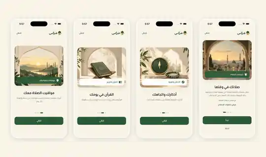

  
    
  <strong>القرآن الكريم · مواقيت الصلاة · الأذكار · التسبيح · القبلة</strong>
   
  A calm Arabic-first Islamic companion built with Flutter.
    
  
  &nbsp;
  

---

## قرآني · Qurani

**قرآني** تطبيق إسلامي مبني باستخدام **Flutter**، يجمع أهم الأدوات اليومية في تجربة عربية هادئة وواضحة: مواقيت الصلاة، القرآن الكريم، الأذكار، التسبيح واتجاه القبلة.

**Qurani** is an Arabic-first Islamic companion built with **Flutter**, bringing prayer times, Quran reading, adhkar, tasbih and Qibla guidance together in one focused mobile experience.

  

## البداية · Onboarding

  

واجهة تعريف بسيطة توضّح أهم ما يقدمه التطبيق قبل الدخول للتجربة الرئيسية: **مواقيت الصلاة، القرآن، الأذكار والقبلة**.

## التجربة الرئيسية · Core Experience

  

| القسم | التفاصيل |
| :--- | :--- |
| 🕌 **مواقيت الصلاة** | المواقيت حسب الموقع، الصلاة القادمة والعد التنازلي |
| 🔔 **تنبيهات الصلاة** | إعدادات وتنبيهات للمحافظة على الصلاة في وقتها |
| 📖 **القرآن الكريم** | قراءة المصحف داخل التطبيق |
| 📿 **التسبيح والأذكار** | سبحة رقمية وأذكار يومية |
| 🕋 **اتجاه القبلة** | بوصلة واضحة لتحديد اتجاه القبلة |
| 📚 **الأربعون النووية** | وصول سريع إلى مجموعة الأربعين النووية |

## Download

The APK is published in the **v1.0.0 GitHub Release**.

## Repository

This repository is the **public showcase** for Qurani. The application source code is private; this repository contains the presentation, screenshots and public Android build.

---

  
    
  Flutter · Hussein Abozina · <a href="mailto:abozina50@gmail.com">Contact</a>

