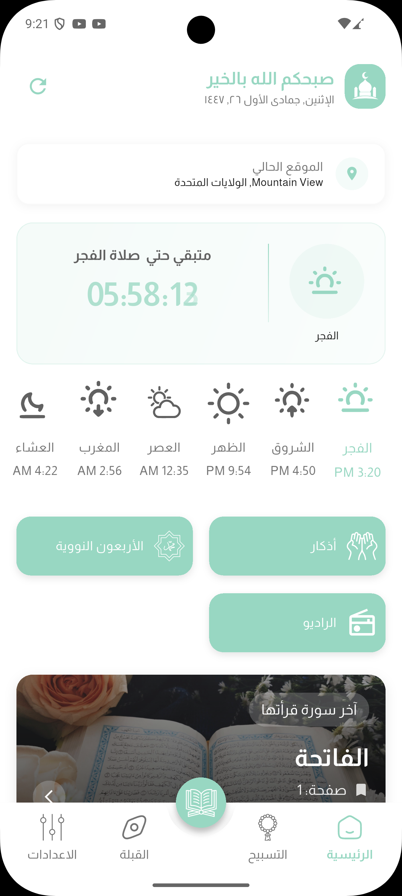
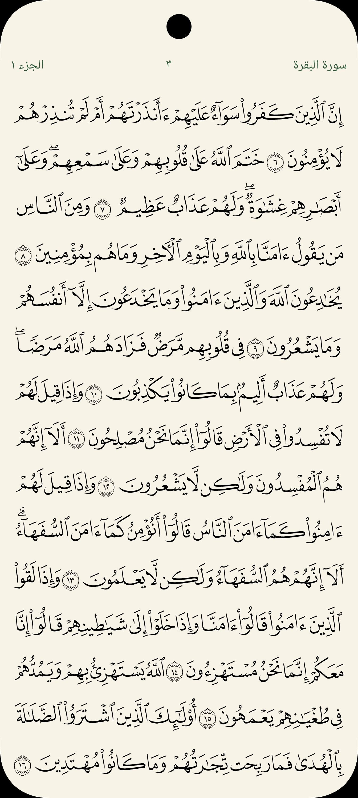
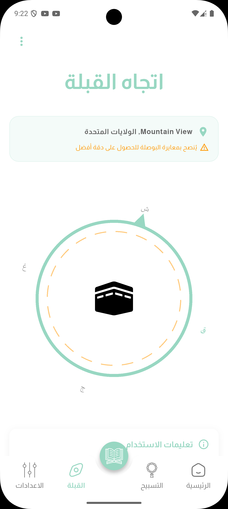
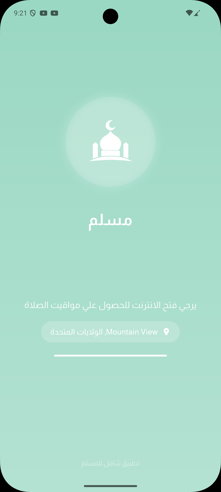
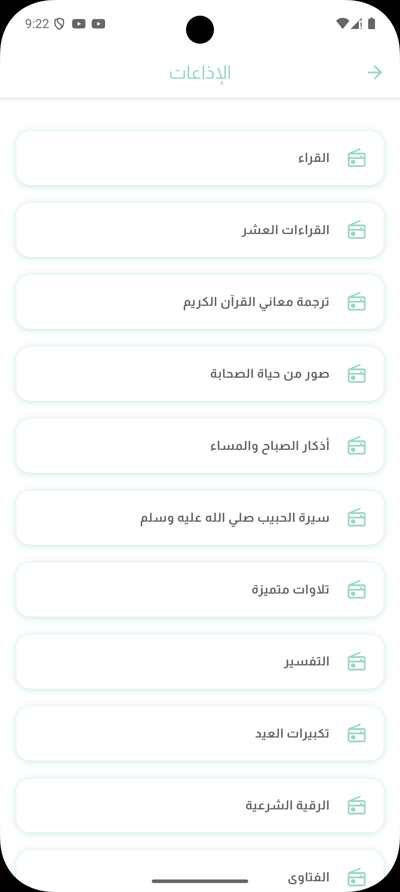

  
    
  <strong>قرآني | Qurani</strong>
  
القرآن الكريم، مواقيت الصلاة، الأذكار والتسبيح — في تجربة عربية هادئة.

  
Quran, prayer times, daily adhkar and tasbih — thoughtfully together.

  
  &nbsp;
  

---

## عن التطبيق · About Qurani

**قرآني** تطبيق إسلامي مبني باستخدام **Flutter**، يجمع الأدوات اليومية التي تحتاجها في مكان واحد، بواجهة عربية واضحة وتصميم هادئ يسهل استخدامه.

**Qurani** is a Flutter-based, Arabic-first Islamic companion designed around everyday worship: quick access to prayer times, Quran reading, remembrance and Qibla direction.

  

## المميزات · Features

| القسم · Feature | التفاصيل · Details |
| :--- | :--- |
| 🕌 **مواقيت الصلاة · Prayer times** | مواعيد الصلاة حسب الموقع مع العد التنازلي للصلاة القادمة · Location-aware schedule and next-prayer countdown |
| 🔔 **تنبيهات الصلاة · Notifications** | إعدادات التنبيه للصلاة · Prayer reminder settings |
| 📖 **القرآن الكريم · Quran** | قراءة المصحف داخل التطبيق · In-app Mushaf reading |
| 📿 **التسبيح والأذكار · Tasbih & Adhkar** | عدّاد تسبيح وأذكار متنوعة · Tasbih counter and remembrance collections |
| 🕋 **القبلة · Qibla** | بوصلة لاتجاه القبلة · Qibla direction compass |
| 📚 **الأربعون النووية · Forty Nawawi** | الوصول إلى مجموعة الأربعين النووية · Access to the Forty Nawawi collection |

## صور التطبيق · App Screenshots

لقطات من التطبيق نفسه. يمكنك الضغط على أي صورة لفتحها بحجم أكبر.

  
  
  

  
<strong>More screenshots · لقطات إضافية</strong>

   
  

    
    
  

> **Screenshot update:** The gallery above still contains captures from the earlier app build. The newer iPhone screenshots supplied for this showcase have not yet replaced these files.

## تجربة التطبيق · Try the App

The Android APK is available in the [v1.0.0 GitHub release](https://github.com/Husseinabozina/muslim-app-showcase/releases/tag/v1.0.0). Download/install the APK from GitHub Releases.

## عن هذا المستودع · Repository Notes

This is the **public showcase** for Qurani. The application source code is stored privately; this repository contains project information, screenshots and the published APK.

هذا المستودع مخصص **لعرض التطبيق** وصوره ونسخة Android المتاحة للتجربة، وليس الكود المصدري الكامل.

---

  
    
  Built with Flutter · Hussein Abozina · <a href="mailto:abozina50@gmail.com">Contact</a>

